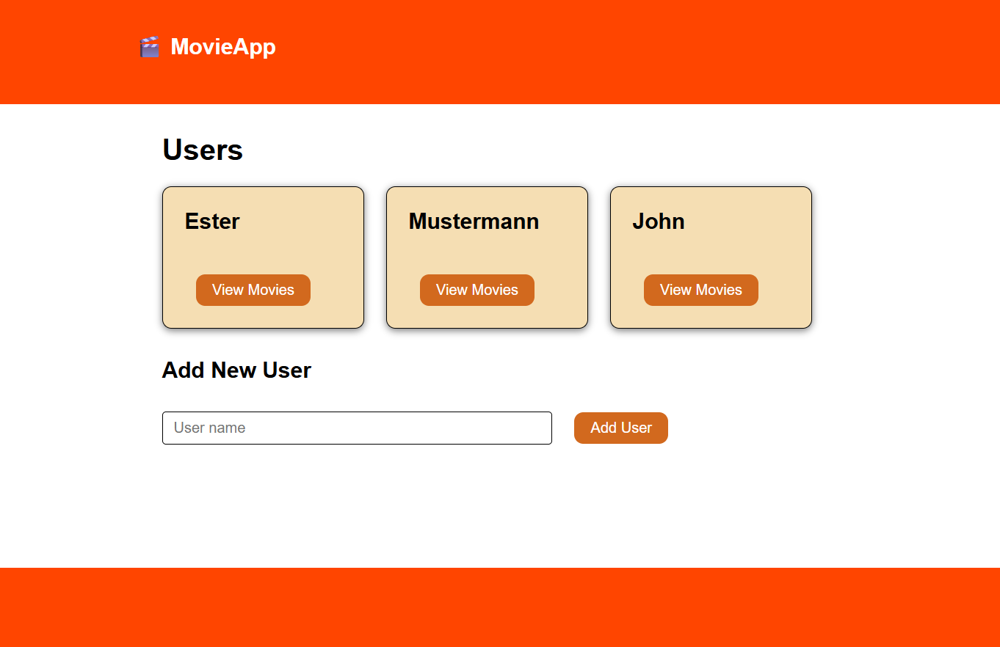
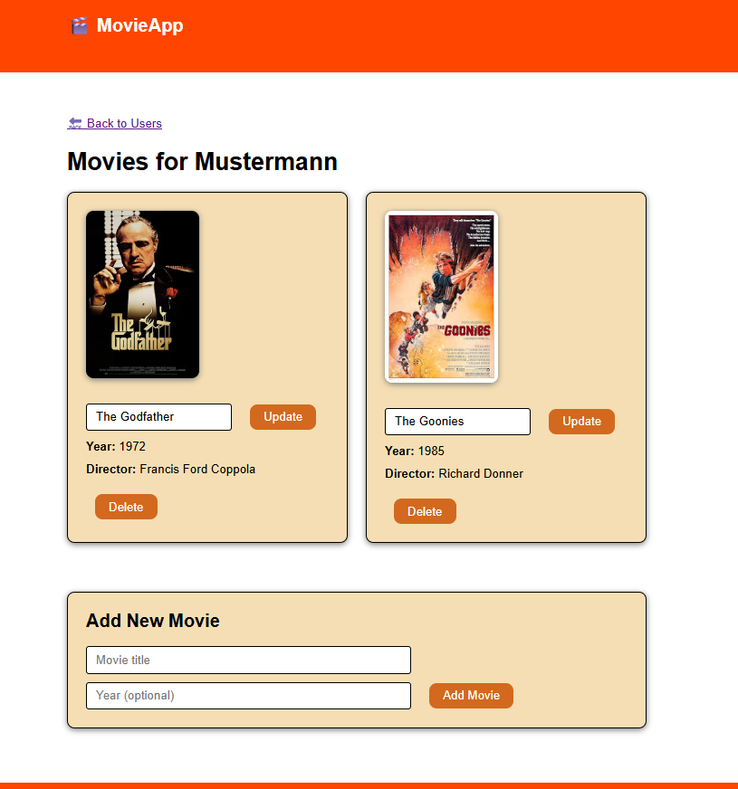

# **MoviWebApp**

---

Digital web application to manage a movie library with different users using Flask and flask-sqlalchemy.

## **Description**

___

This project was developed as a practice assessment for a Software Engineering Bootcamp in Masterschool.
It demonstrates:

- dynamic web development using Jinja2 
- Flask concepts such as:
  - routing
  - template rendering
  - form handling
- Use of APIs (OMDB API)
- Object-Oriented Programming with SQL

## **Overview**

MovieWebApp creates a relational database for books, which contains two tables: 
movies and users, with the corresponding information.
The homepage shows the users and it is possible from there to add new users.
You can decide to show the movies for each user, you are redirected to an other html page, where all the movies are displayed.
From there you can also add and delete new movies, or update the title.

## **Application Structure**

___

- User Interface (UI):
    - An intuitive web interface built using Flask, HTML, and CSS.
    - It will provide forms for adding, updating, and deleting movies, as well as a method to select a user.
- Data Management: 
    - A Python class to handle operations related to the database.
    - This class will expose functions for getting a list of all users, getting a user’s movies, and updating a user’s movie.

## **Features**

___
1. User Creation and Selection:
    - New users will be able to create an identity on the website.
    - Then, when they log into the website, they can select their identity from a list of users.
2. Movie Management
   - After a user is selected, the application will display a list of their favorite movies.
    From here, users can:
   -  Add a movie: Using the name of the movie, and the app will fetch other information from OMDb.
   - Delete a movie: Remove a movie from their list.
   - Update a movie: Modify the information of a movie from their list.
   - List all movies: View all the movies on their list.


## Technologies Used

___

| Technology       | Purpose                                          |
|:-----------------|:-------------------------------------------------|
| Python           | Core application                                 |
| Flask            | Web framework                                    |
| flask_sqlalchemy | Extension for Flask, adds support for SQLAlchemy |
| HTML             | Generated blog website                           |
| CSS              | Style content of webpage                         |
| SQL              | Structured Query Language                        |
| OMDB API | Used to retrieve the movie information           |


## **How It Works** ##

___

1. Run the app.py file.
2. Route /: Homepage: A list of users is displayed



   - There is a form where you can add a new user (Route: /users).
   - View Movies Button for each user: You are redirected to the movies.html page (Route: /users/<int:user_id>/movies).



   - The movies for the selected user are displayed: Poster, Title, release year and director.
   - The user can update the title of the movie by clicking the update button. (Route: /users/<int:user_id>/movies/<int:movie_id>/update).
   - The user can delete the movie from the database by clicking the delete button (Route: /users/<int:user_id>/movies/<int:movie_id>/delete).
   - There is a form to add a new movie. The title is a required field. The application will look for the movie with the OMDB API.
        If the movie is found, the movie will be added to the database (Route: /users/<int:user_id>/movies).


## **Installation**

___

1. Get a free API Key at https://www.omdbapi.com/
2. Clone the repository:


```
git clone https://github.com/esterplaza/MoviWebApp.git
```
3. Install requirements:

```
pip install -r requirements.txt
```

4. Enter your API KEY.

This project requires an API key to access the animal data service.

Create a .env file in the project root directory:

```
API_KEY="your_api_key_here"
```

Replace your_api_key_here with your own API key.

The .env file is not included in the repository for security reasons.

5. Change git remote url to avoid accidental pushes to base project

```
   git remote set-url origin github_username/repo_name
   git remote -v # confirm the changes
```


## External Services

___

This project retrieves movie information using the OMDb API.

API website: https://www.omdbapi.com/

Movie data is fetched when adding new movies and then stored locally in an SQLite database.

## **Running the Application**

___

Start the program:

```
python add.py
```

## **Database Design**

___

Users and movies are stored locally using SQLite. 

The database contains information such as:

Users:
- Name

Movies: 
- Movie title
- Director
- Release year
- IMDb rating
- Poster URL

## **Usage**

___


## Acknowledgments

___

- Built using Flask, SQLAlchemy.
- Movie data provided by the OMDb API.

## **Contact**

___

Ester Plaza Fernández - esterplaza@gmail.com

Project Link: https://github.com/esterplaza/MoviWebApp.git
